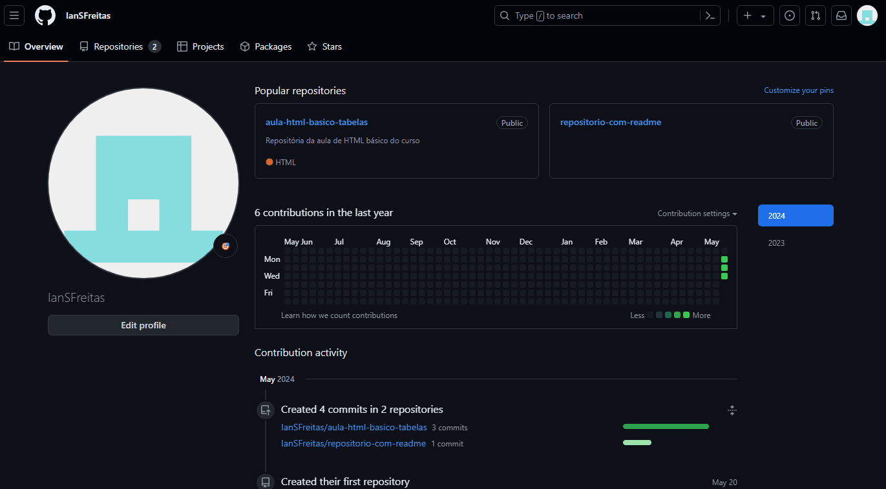

# Projeto primeiro README
Um projeto de teste com o arquivo README 🚀

[](https://www.linkedin.com/in/ian-da-silva-de-freitas-3b53a7230/)

## Tecnologia utilizadas
- HTML
- CSS
- JS

## Como utilizar

1 - Clone pro projeto
```
git clone <url>
```

2 - Acesse a pasta do projeto
```
cd repositorio-com-readme
```